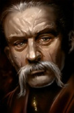

<html>

<b>Gorion's Dream Restored</b>

<b>For BGEE or EET</b>

The mod unearths an unused Bhaal dream sequence from the original game and turns it into a mini-quest in Chapter 7 of BGEE or EET. 
 
You encounter an interactive sequence during a rest after you have read Gorion's letter about your heritage. The dream confronts you with decisions that impact yourself as well as others. The outcome of the dream depends on your choices.

At the end of the sequence the player gets a choice for some new ability that will depend on the decisions made during the dream.

Many dialogues and the concept of the events are taken from original dialogues that were not used in the released game.
 
&nbsp;

&nbsp;

</body>

</html>

